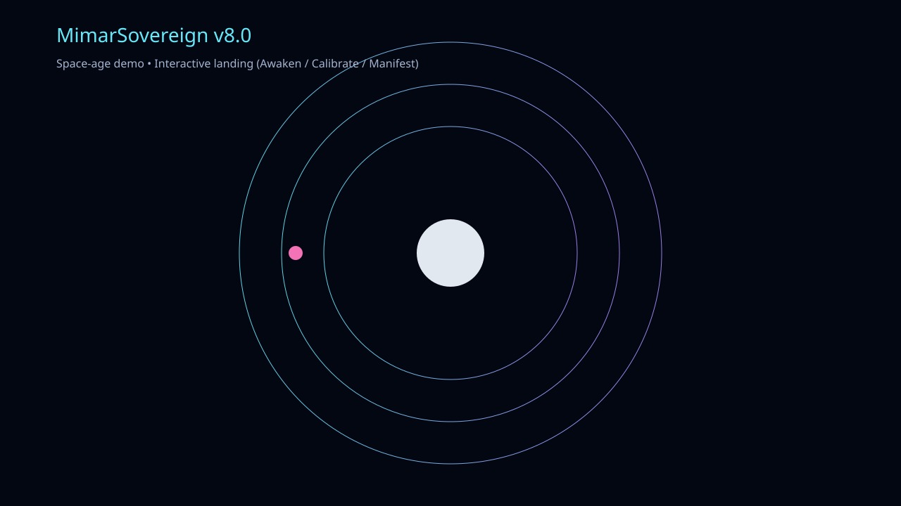

# MimarSovereign v8.0

A focused public demo for a private AI operations platform: a control layer that turns intent into validated execution, across tools, workflows, and decision points.

MimarSovereign is positioned as a system for AI-driven orchestration rather than a simple chatbot. The public-facing repository showcases the visual identity and demo experience, while the production system remains private and protected behind a proprietary implementation.

## What this project demonstrates

- A high-contrast, futuristic landing page for product storytelling and investor attention.
- Interactive states: Awaken, Calibrate, and Manifest.
- A strong public “teaser” layer that exposes the brand without revealing the core engine.
- A GitHub Pages deployment model suitable for quick proof-of-concept visibility.

## Product positioning

Most AI tools today are either:

- assistant interfaces that generate content but do not own execution,
- workflow tools that automate steps without strategic coordination,
- or prototyping platforms that accelerate demos without real operational governance.

MimarSovereign is different: it is designed as an orchestration layer for intent-driven systems.

The public-facing demo communicates the concept, while the private implementation is intended to include:

- goal-oriented planning and state management,
- tool coordination and execution routing,
- approval gates and safety boundaries,
- observability, traceability, and operational logging,
- private deployment patterns for high-value production environments.

## Why the public repo stays lean

This repository is intentionally public-facing and intentionally limited. We keep the proprietary engine private to protect:

- system architecture,
- domain-specific logic,
- security and validation layers,
- operational trade secrets,
- and strategic product execution paths.

The public repo serves as a demo gateway: enough to signal capability, attract attention, and establish interest without exposing the actual product engine.

## Run locally

Open `index.html` directly in a browser, or serve it locally:

```bash
python -m http.server 8000
```

Then visit:

```text
http://localhost:8000
```

## Publish to GitHub Pages

This repository already includes a Pages workflow in `.github/workflows/pages.yml`.

1. Push the branch to GitHub.
2. Wait for the GitHub Actions deployment to complete.
3. Your demo will be published under the GitHub Pages URL for the repository.

Example:

```text
https://sytnax1-art.github.io/mimarsovereign/
```

## Recommended public strategy

Keep the public story focused on:

- visual identity
- product concept
- operational AI narrative
- high-signal demo interactions
- polished brand storytelling

Keep private:

- source code
- orchestration engine
- business logic
- security checks
- real deployment architecture

## Summary

This repository is not the product itself; it is the public-facing front door to the product story. It is designed to look premium, signal technological ambition, and generate interest while preserving the real value behind a private implementation.
